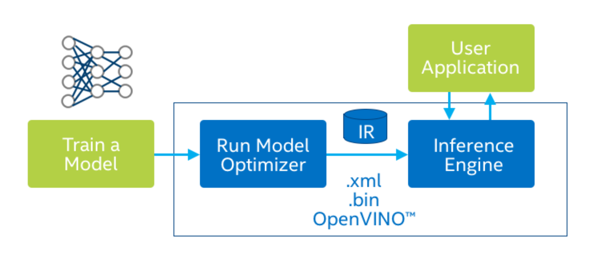

## Intel OpenVINO 使用教學

### Youtube 教學視頻:

​	English:

​		<https://www.youtube.com/playlist?list=PLDKCjIU5YH6jMzcTV5_cxX9aPHsborbXQ>

​	Chinese:

​		<https://www.youtube.com/playlist?list=PLDKCjIU5YH6jF8_Za7vEflrUKJ5hj6qy3>


### 安裝:

- Windows:   

  預設裝在 C:\Program Files (x86)\IntelSWTools

  <https://docs.openvinotoolkit.org/latest/_docs_install_guides_installing_openvino_windows.html>

- Linux:   

  預設裝在 /opt 

  https://docs.openvinotoolkit.org/latest/_docs_install_guides_installing_openvino_linux.html>

- MacOS:  

  預設裝在 /opt 

  <https://docs.openvinotoolkit.org/latest/_docs_install_guides_installing_openvino_macos.html>


### 常用啟動指令:

在每一次新開 terminal 之後，都需要重設環境變數才能使用 openVINO 功能 !!

Windows:

```bash
"C:\Program Files (x86)\IntelSWTools\openvino\bin\setupvars.bat"
```

Linux/MacOS:

```bash
source /opt/intel/openvino/bin/setupvars.sh
```


<div style="page-break-after: always;"></div>


## openVINO 主要概念:



提升執行預測端的效能，並輕易部署在 intel 環境 (CPU,GPU,FPGA,NCS2)

#### Model Optimizer (Python)

- 概念:  把訓練好的深度學習 AI CNN-based 模型+權重檔，如: tensorflow (.pb) , pytorch (.onnx) , caffe , MXNet 經由官方寫好的 mo.py 轉換成 IR 格式 (.xml , .bin)，把模型架構(數學上運算)給優化

  ```python
  # 執行以下程式會有 mo.py 的用法 ,(Linux可能要用 python3)
  python mo.py -h
  ```


-  mo.py 位置:   

  Windows:  

  ```python
  "C:\Program Files (x86)\IntelSWTools\openvino\deployment_tools\model_optimizer\"
  ```

  Linux/Mac:

  ```json
  "/opt/intel/openvino/deployment_tools/model_optimizer"
  ```


- 支援深度學習模型列表:

  <https://docs.openvinotoolkit.org/latest/_docs_MO_DG_prepare_model_Supported_Frameworks_Layers.html>

- 施工區~~  tensorflow(keras) 轉 .pb , pytorch 轉 .onnx  需要寫教學 !!

  ​	pytorch : torch.onnx <https://pytorch.org/docs/stable/onnx.html>

  ​	

#### Inference Engine (C++/Python)

- 概念:  底層為 C++ 函式庫，也有 Python API，提供許多物件類別 class ，為實際需要程式實作部分!!

- API reference C++ 連結:

  <https://docs.openvinotoolkit.org/latest/annotated.html>

- API reference Python 連結:

  <https://docs.openvinotoolkit.org/latest/_inference_engine_ie_bridges_python_docs_api_overview.html>

- 施工區~~  官方範例教學不多，研究中 ....


<div style="page-break-after: always;"></div>

### 官方 demos/samples:

#### build 建構指令

- Windows: 

  官方教學

  <https://docs.openvinotoolkit.org/latest/_docs_IE_DG_Samples_Overview.html#build_samples_windows>

  或執行以下指令 !! 

  ```bash
  "C:\Program Files (x86)\IntelSWTools\openvino\deployment_tools\inference_engine\demos\build_demos_msvc.bat"
  
  "C:\Program Files (x86)\IntelSWTools\openvino\deployment_tools\inference_engine\samples\build_samples_msvc.bat"
  ```

- Linux/MacOS: 

  官方教學

  <https://docs.openvinotoolkit.org/latest/_docs_IE_DG_Samples_Overview.html#build_samples_linux>

  或執行以下指令 !! 

  ```bash
  "/opt/intel/openvino/deployment_tools/inference_engine/demos/build_demos.sh"
  
  "/opt/intel/openvino/deployment_tools/inference_engine/samples/build_samples.sh"
  ```


#### build 預設執行檔，輸出位置:

註: [username] 請取代為使用者名字

- Windows:

  samples

  ```json
  cd "C:\Users\[username]\Documents\Intel\OpenVINO\inference_engine_samples_build\intel64\Release"
  ```

  demos

  ```json
  cd "C:\Users\[username]\Documents\Intel\OpenVINO\omz_demos_build\intel64\Release"
  ```

- Linux/MacOS:  

  samples

  ```json
  cd "/Users/[username]/inference_engine_samples_build/intel64/Release"
  ```

  demos

  ```json
  cd "/Users/[username]/omz_demos_build/intel64/Release"
  ```

<div style="page-break-after: always;"></div>

#### demos / samples 表

終端機指令 :   

```bash
[runfile] -i[inputfile] -m [XMLfile]  -d [device]
```

- [demofile] 為 demos/samples 執行檔名  (Linux 執行需使用 ./[runfile] 語法)
- [inputfile] 為輸入圖片/影片名 , 

- [XMLfile]  為經過 Mo 預訓練模型 
- [device] 為配置 CPU or GPU  


demos

| 檔案名                                   | 概述             | Input | Output      | github 說明                                                  |
| ---------------------------------------- | ---------------- | ----- | ----------- | ------------------------------------------------------------ |
| crossroad_camera_demo                    | 框住馬路上的人   | .mp4  | 即時 render | <https://github.com/opencv/open_model_zoo/tree/master/demos/crossroad_camera_demo> |
| gaze_estimation_demo                     | 偵測臉輪廓       | .mp4  | 即時 render | <https://github.com/opencv/open_model_zoo/tree/master/demos/gaze_estimation_demo> |
| human_pose_estimation_demo               | 偵測骨架         | .mp4  | 即時 render | <https://github.com/opencv/open_model_zoo/tree/master/demos/human_pose_estimation_demo> |
| interative_face_detection_demo           | 臉部表情         | .mp4  | 即時 render | <https://github.com/opencv/open_model_zoo/tree/master/demos/interactive_face_detection_demo> |
| mask_rcnn_demo                           | 圖像分割         | .bmp  | .bmp        | <https://github.com/opencv/open_model_zoo/tree/master/demos/mask_rcnn_demo> |
| multi-channel-face-detection-demo        |                  | .mp4  | 即時 render | <https://github.com/opencv/open_model_zoo/tree/master/demos/multichannel_demo/fd> |
| multi-channel-human-pose-estimation-demo |                  | .mp4  | 即時 render | <https://github.com/opencv/open_model_zoo/tree/master/demos/multichannel_demo/hpe> |
| object_detection_demo_faster_rcnn        | 物件偵測         | .bmp  | .bmp        | <https://github.com/opencv/open_model_zoo/tree/master/demos/object_detection_demo_faster_rcnn> |
| object_detection_demo_ssd_async          | 物件偵測         | .mp4  | 即時 render | <https://github.com/opencv/open_model_zoo/tree/master/demos/object_detection_demo_ssd_async> |
| object_detection_demo_yolov3_async       | 物件偵測         | .mp4  | 即時 render | <https://github.com/opencv/open_model_zoo/tree/master/demos/object_detection_demo_yolov3_async> |
| pedestrian_tracker_demo                  | 行人追蹤         | .mp4  | 即時 render | <https://github.com/opencv/open_model_zoo/tree/master/demos/pedestrian_tracker_demo> |
| security_barrier_camera_demo             | 行車紀錄器       | .mp4  | 即時render  | <https://github.com/opencv/open_model_zoo/tree/master/demos/security_barrier_camera_demo> |
| segmentation_demo                        | 圖像分割         | .bmp  | .bmp        | <https://github.com/opencv/open_model_zoo/tree/master/demos/segmentation_demo> |
| smart_classroom_demo                     | 教室監視         | .mp4  | 即時render  | <https://github.com/opencv/open_model_zoo/tree/master/demos/smart_classroom_demo> |
| super_resolution_demo                    | 圖片還原高解析度 | .bmp  | .bmp        | <https://github.com/opencv/open_model_zoo/tree/master/demos/super_resolution_demo> |
| text_detection_demo                      | 文字辨識         | .bmp  | .bmp        | <https://github.com/opencv/open_model_zoo/tree/master/demos/text_detection_demo> |


samples

| 檔案名                          | 官網說明                                                     |
| ------------------------------- | ------------------------------------------------------------ |
| benchmark_app                   | <https://docs.openvinotoolkit.org/latest/_inference_engine_samples_benchmark_app_README.html> |
| classification_samples_async    | <https://docs.openvinotoolkit.org/latest/_inference_engine_samples_classification_sample_async_README.html> |
| hello_classfication             | <https://docs.openvinotoolkit.org/latest/_inference_engine_samples_hello_classification_README.html> |
| hello_nv12_input_classification | <https://docs.openvinotoolkit.org/latest/_inference_engine_samples_hello_nv12_input_classification_README.html> |
| hello_query_device              | <https://docs.openvinotoolkit.org/latest/_inference_engine_samples_hello_query_device_README.html> |
| hello_reshape_ssd               | <https://docs.openvinotoolkit.org/latest/_inference_engine_samples_hello_reshape_ssd_README.html> |
| object_detection_sample_ssd     | <https://docs.openvinotoolkit.org/latest/_inference_engine_samples_object_detection_sample_ssd_README.html> |
| speech_sample                   | <https://docs.openvinotoolkit.org/latest/_inference_engine_samples_speech_sample_README.html> |
| style_transfer_sample           | <https://docs.openvinotoolkit.org/latest/_inference_engine_samples_style_transfer_sample_README.html> |


下載所有 demo 會用到的預訓練模型 [YOUR_DIR] = 代表你要存的地方

```bash
cd "C:\Program Files (x86)\IntelSWTools\openvino\deployment_tools\open_model_zoo\tools\downloader"

python downloader.py --all -o [YOUR_DIR]
```


下載範例影片，到達 [YOUR_DIR]

```bash
git clone https://github.com/intel-iot-devkit/sample-videos.git
```


